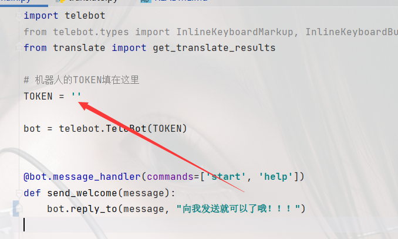
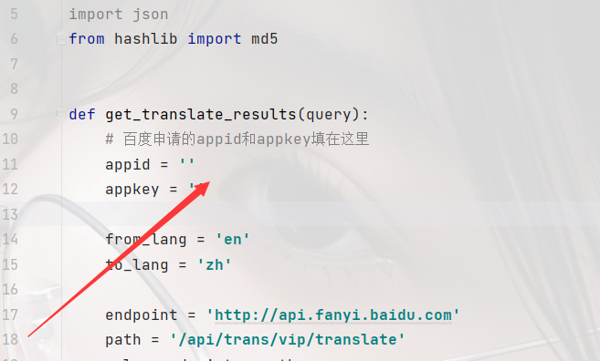

# telegram_translate_robot

一个Telegram上的翻译机器人

## 使用方法

```
git clone https://github.com/yuxian158/telegram_translate_robot.git
cd telegram_translate_robot
#修改main.py中的
```


```
virtualenv venv
venv\Scripts\python.exe main.py
```